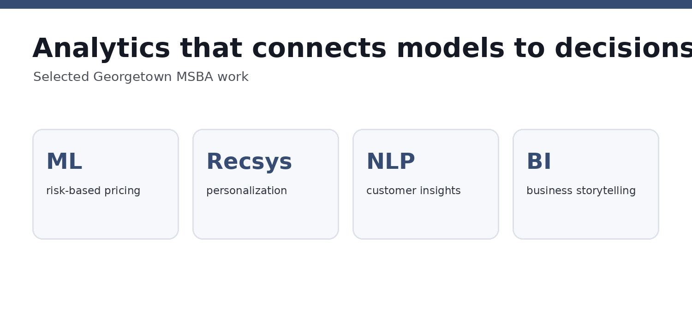

# Hannah Son \| Business Analytics Portfolio

**MS Business Analytics, Georgetown University · December 2026**\
**Clinical research + business analytics · New York, NY**

I use analytics to turn complex data into decisions. This portfolio
highlights applied machine learning, recommendation systems, NLP, data
visualization, and business interpretation.

## Featured work

  ---------------------------------------------------------------------------------------------------
  Project                                             What it demonstrates    Evidence
  --------------------------------------------------- ----------------------- -----------------------
  [LendingClub Interest Rate                          Machine learning,       Model-performance
  Prediction](projects/lendingclub/)                  feature engineering,    visual + verified
                                                      leakage-safe            project methodology
                                                      validation, model       
                                                      comparison,             
                                                      explainability          

  [Goodreads Personalized                             Collaborative           **Actual Streamlit
  Recommender](projects/goodreads-recommender/)       filtering, ranking      Python app** +
                                                      metrics, LLM            architecture visual
                                                      re-ranking, product     
                                                      development             

  [Hotel Review Text                                  NLP, BERTopic, LDA,     **Actual executed
  Analytics](projects/hotel-review-text-analytics/)   customer insights       notebook HTML** +
                                                                              Python pipeline + topic
                                                                              visual
  ---------------------------------------------------------------------------------------------------

## At a glance

## Technical toolkit

`Python` · `SQL` · `R` · `Excel` · `Tableau` · `CatBoost` · `XGBoost` ·
`SHAP` · `Collaborative Filtering` · `Gemini` · `Streamlit` · `LDA` ·
`BERTopic`

## What I bring

I pair hands-on analytics training with several years of experience
working with clinical and healthcare data. I am especially interested in
business, data, consumer, and commercial analytics roles where technical
analysis needs to translate into a clear recommendation.

**LinkedIn:** www.linkedin.com/in/hannah-son-34ba49177
