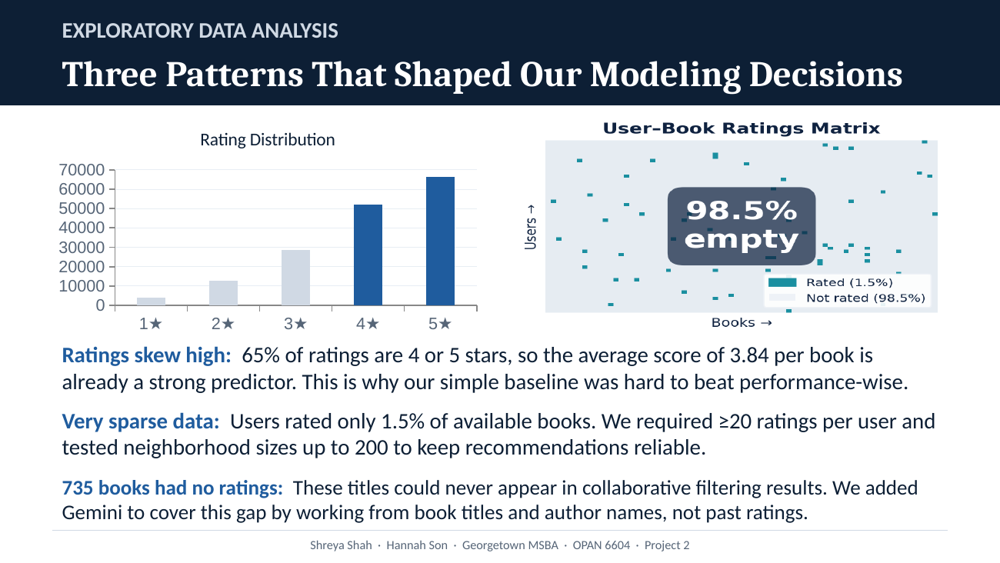
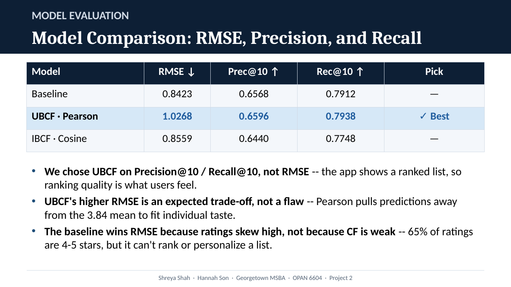
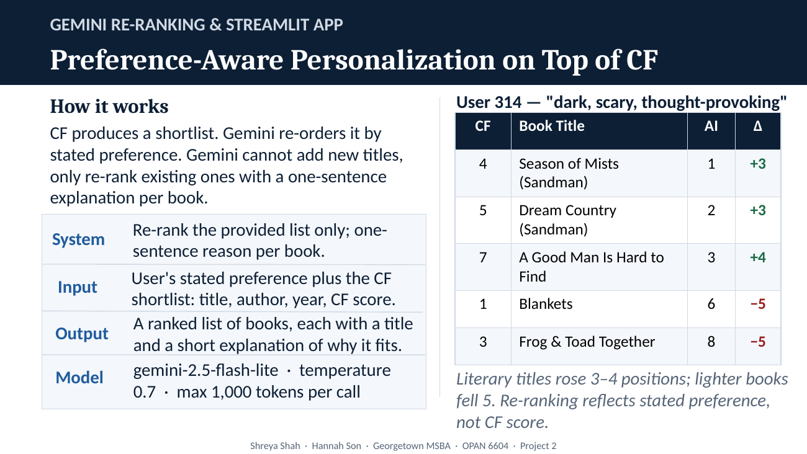
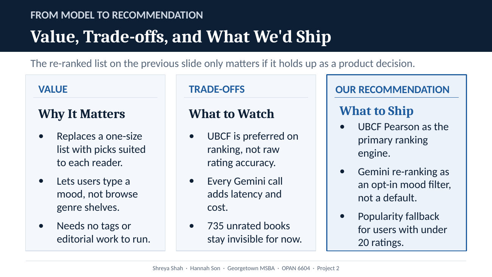

# Goodreads Personalized Recommender

**Recommendation systems · ranking metrics · LLM re-ranking · Streamlit**

This project started with a simple question: **how do you make book recommendations feel personal when the ratings data is extremely sparse?**

The final system uses collaborative filtering to generate candidate books, then gives the user an optional Gemini re-ranking step based on what they feel like reading.

## Data and EDA

The working dataset included **1,192 active users, 9,964 books and about 164K ratings**. The user-book matrix was **98.5% empty**, and ratings were heavily skewed toward 4 and 5 stars.

That mattered because it explained two things early: a simple baseline would be competitive on RMSE, and neighborhood-based recommenders would have to deal with very sparse overlap between users.

## Model evaluation

I compared a bias-based baseline with user- and item-based collaborative filtering.

**UBCF Pearson was selected for the product** because it produced the strongest ranked lists:
- Precision@10: **0.6596**
- Recall@10: **0.7938**

The baseline had the best RMSE, but RMSE was not the only metric that mattered. Users interact with a ranked list of recommendations, so Precision@10 and Recall@10 were more aligned with the actual product experience.

## Adding an LLM layer

Collaborative filtering can identify books a user is likely to enjoy, but it does not understand a request such as *“dark and thought-provoking.”* Gemini was added as a second-stage re-ranker. It only re-orders the books supplied by the collaborative-filtering model.

This kept the recommendation engine grounded in observed user behavior while adding a more flexible preference layer.

## From model to product

The Streamlit app lets a user:
1. choose a reader profile,
2. generate collaborative-filtering recommendations,
3. enter a mood or preference,
4. re-rank the list with Gemini,
5. view short explanations for the new ranking.

**[View the app code](app.py)** · **[View the executed notebook](analysis_notebook.ipynb)**

The product recommendation was to use **UBCF Pearson as the primary ranking engine**, keep Gemini re-ranking optional, and use a popularity fallback for users with limited history.

## Tools

`Python` `pandas` `Surprise` `Collaborative Filtering` `Precision@10` `Recall@10` `Gemini` `Streamlit` `Prompt Engineering`
