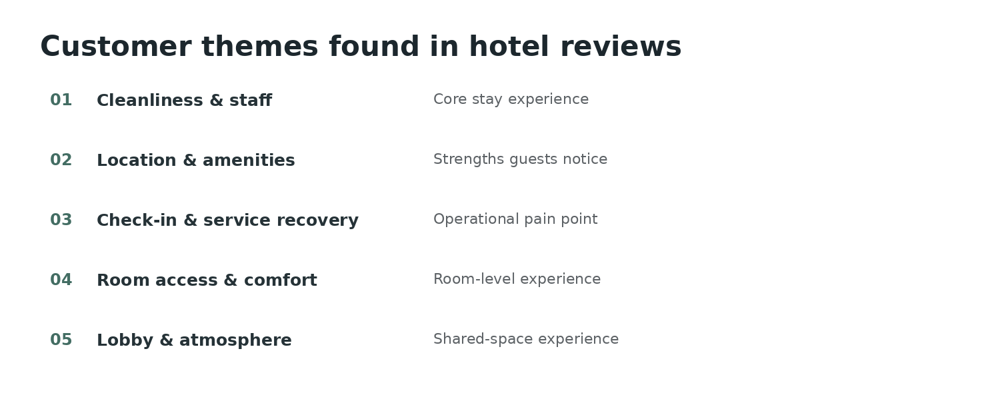

# Hotel Review Text Analytics

**NLP · topic modeling · customer insights · business interpretation**

The goal was to take a large set of hotel reviews and answer a practical customer-experience question: **what are guests consistently talking about, and which themes point to strengths or operational issues?**

## Approach

I used two topic-modeling approaches:
- **LDA** for a traditional probabilistic topic model
- **BERTopic** for embedding-based topic discovery

For BERTopic, the workflow used sentence-transformer embeddings and a custom `CountVectorizer`. I also included bigrams so phrases such as **“front desk”** would stay meaningful in the topic labels.

## Key themes



The analysis surfaced recurring themes around cleanliness and staff, location and amenities, front-desk / service recovery, room comfort, and lobby atmosphere.

The business value was in turning thousands of unstructured comments into a smaller set of issues that could be discussed by an operations or customer-experience team.

## Code and executed analysis

**[View the executed notebook](analysis_notebook.ipynb)**  
**[View the original notebook export](analysis_notebook.html)**

The notebook includes the actual text-processing and BERTopic workflow, including sentence embeddings, domain-specific stop words, n-grams and topic assignment.

## Example BERTopic setup

```python
embedding_model = SentenceTransformer("BAAI/bge-small-en-v1.5")

vectorizer_model = CountVectorizer(
    stop_words=custom_stops,
    min_df=1,
    ngram_range=(1, 2)
)

topic_model = BERTopic(
    embedding_model=embedding_model,
    vectorizer_model=vectorizer_model,
    min_topic_size=15,
    nr_topics="auto"
)

topics, probs = topic_model.fit_transform(docs)
```

## Tools

`Python` `scikit-learn` `SentenceTransformers` `BERTopic` `LDA` `NLP` `Topic Modeling`
