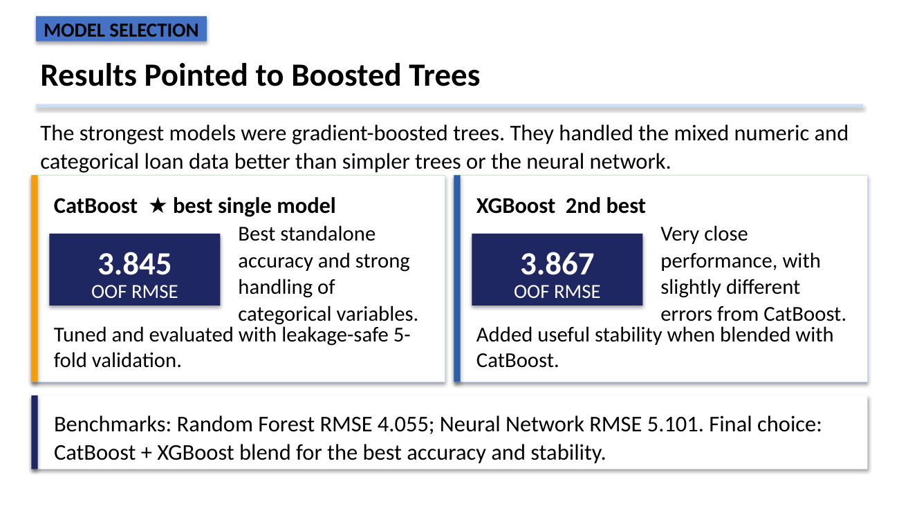
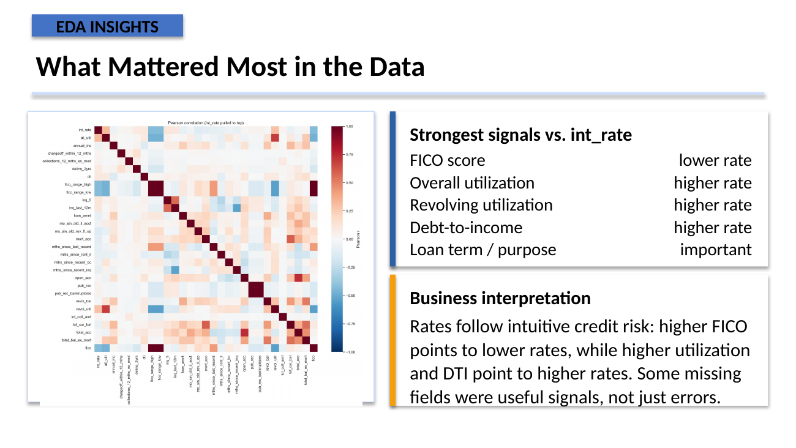
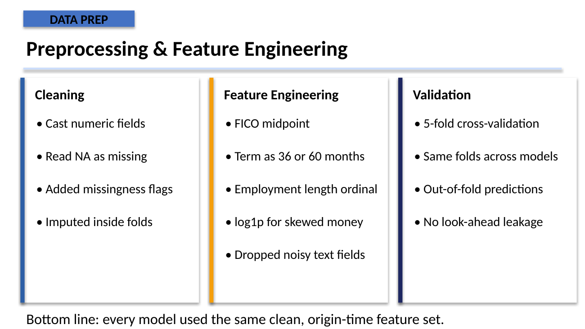
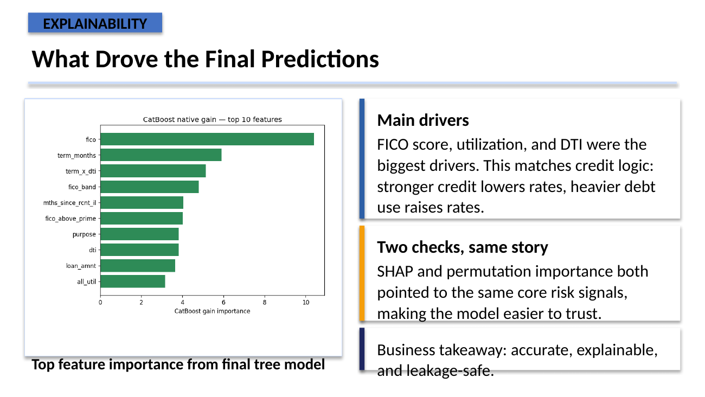

# LendingClub Interest Rate Prediction

**Machine learning · feature engineering · model validation · explainability**

The goal was to predict a borrower's interest rate using only information that would have been available when the loan was originated. The main challenge was not just accuracy — it was building a model that was realistic and did not rely on information from the future.

## Result

**CatBoost was the strongest standalone model with an out-of-fold RMSE of 3.845.** XGBoost followed closely at 3.867. The final project used the strongest boosted-tree models while keeping the validation setup consistent across approaches.

## What mattered in the data

FICO score, utilization and debt-to-income were the clearest drivers of predicted interest rates. Higher credit quality generally pushed rates down, while heavier debt use pushed rates up.

## Modeling approach

I worked through the full modeling pipeline: cleaning, feature engineering, leakage control, cross-validation, model comparison and explainability.

Models evaluated included:
- CatBoost
- XGBoost
- LightGBM
- Random Forest / Extra Trees
- Decision Tree
- Neural Network

The same folds and origin-time feature set were used across models so the comparison stayed fair.

## Explainability

I used feature importance, SHAP and permutation importance to check whether the model was learning sensible credit-risk relationships rather than exploiting leakage.

## Tools

`Python` `pandas` `scikit-learn` `CatBoost` `XGBoost` `LightGBM` `SHAP` `Cross-validation`

> The original executable notebook was not available in the project files I used to build this public repository, so I have not recreated code and presented it as the original analysis.
