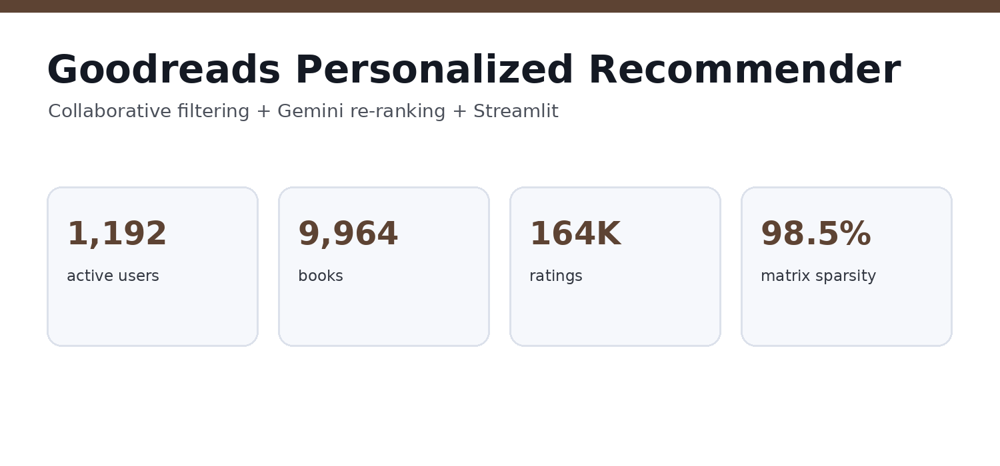
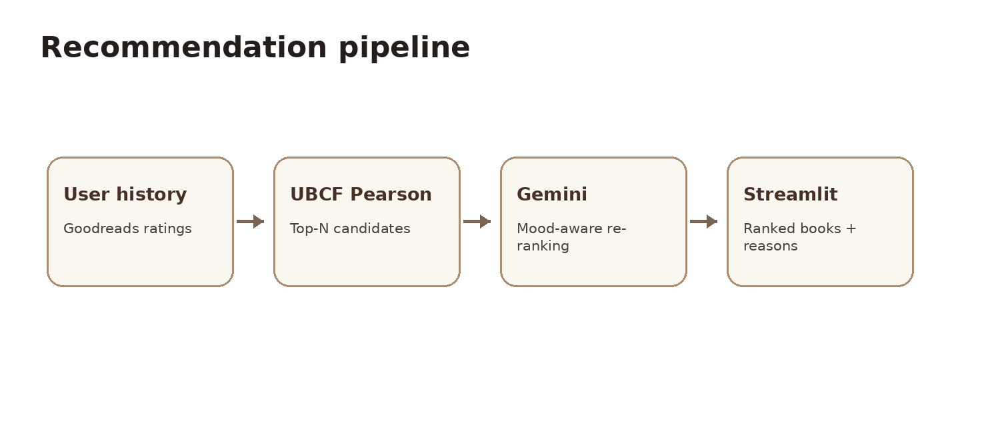

# Goodreads Personalized Book Recommender

## From ratings to a usable product

The project compared a bias-based baseline, user-based collaborative
filtering, and item-based collaborative filtering. **UBCF Pearson was
selected because it performed best on Precision@10 and Recall@10**, the
metrics most aligned with a ranked recommendation experience.

## What I built

-   Collaborative-filtering candidate generation using Goodreads
    ratings.
-   User-based Pearson and item-based cosine approaches alongside a
    baseline.
-   Gemini re-ranking that incorporates a user's stated mood or
    preference.
-   A Streamlit interface for selecting a user, generating
    recommendations, applying a preference, and comparing rankings.
-   API-key handling through Streamlit secrets/environment variables
    rather than hard-coding credentials.

## Actual code

**[View the Streamlit application source →](app.py)**

The app contains the collaborative-filtering configuration,
candidate-generation workflow, interface logic, and Gemini integration
used for the project.

## Technical stack

`Python` · `pandas` · `Surprise` · `Collaborative Filtering` · `Gemini`
· `Streamlit` · `Precision@10` · `Recall@10`
