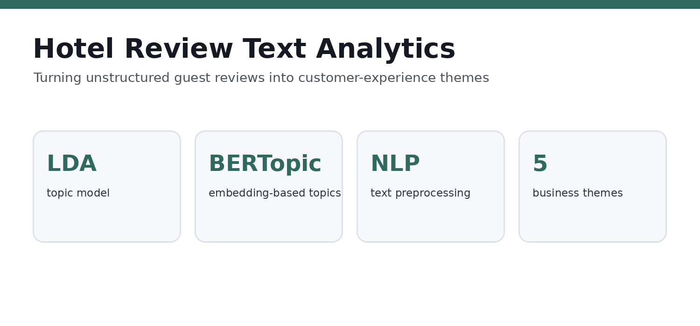
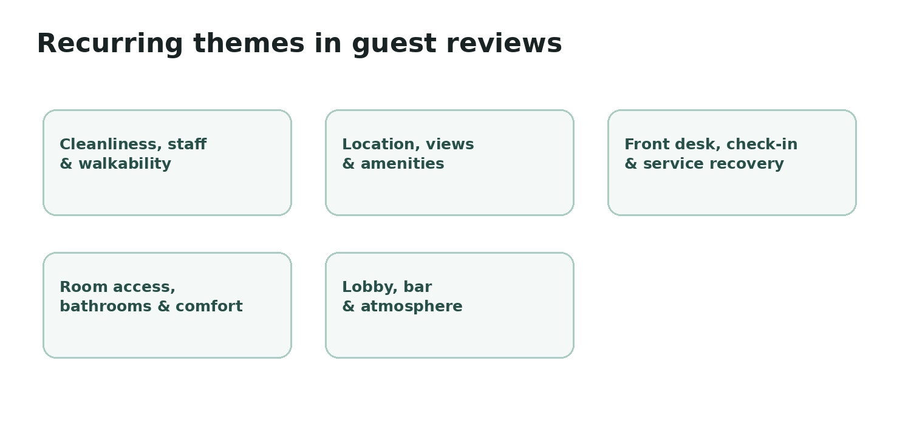

# Hotel Review Text Analytics

## What the reviews were actually about

The analysis used topic modeling to turn a large body of unstructured
hotel reviews into interpretable customer-experience themes.

## Technical approach

-   Prepared review text and expanded standard English stop words with
    domain-specific terms.
-   Used sentence-transformer embeddings with **BERTopic**.
-   Used `CountVectorizer` with unigrams and bigrams so phrases such as
    "front desk" could appear in topic representations.
-   Compared/used topic-modeling approaches including **LDA and
    BERTopic**.
-   Translated model output into business-friendly themes and
    recommendations.

## Actual code and notebook

**[View representative BERTopic Python pipeline
→](bertopic_pipeline.py)**\
**[View the executed notebook export →](topic_modeling_notebook.html)**

The notebook export is included so recruiters can inspect the real
executed analysis rather than a recreated example.

## Business takeaway

Positive experience themes centered on location, amenities, atmosphere,
cleanliness, and staff, while service execution and
front-desk/service-recovery issues were important operational themes.

## Technical stack

`Python` · `scikit-learn` · `SentenceTransformers` · `BERTopic` · `LDA`
· `NLP` · `Topic Modeling`
