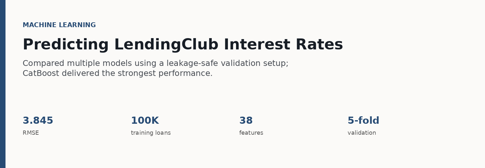
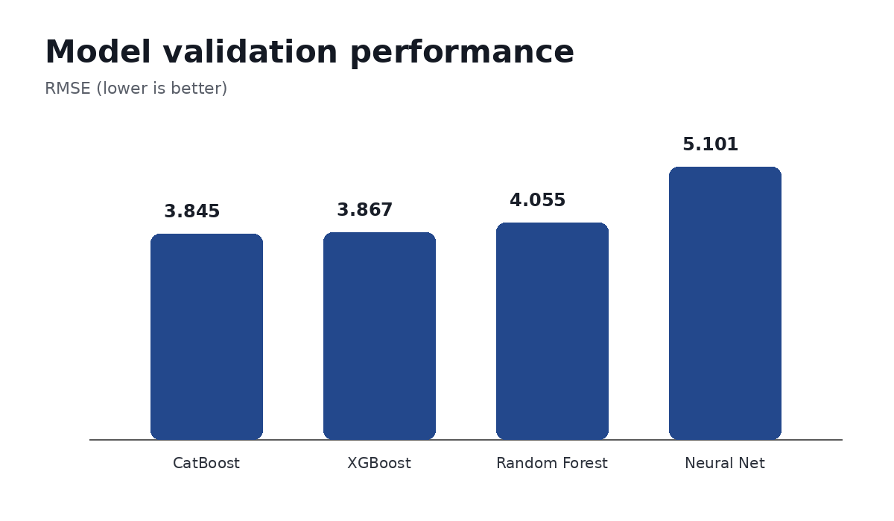

# Predicting LendingClub Interest Rates

**Question:** Can we predict the interest rate a borrower receives using
only information available at application?

## What I found

**CatBoost performed best at 3.845 RMSE.** XGBoost was close behind at
3.867, while Random Forest and the neural network performed worse.

FICO score was the strongest driver of the model, followed by
utilization and debt burden. The results matched the business logic of
risk-based loan pricing.

## What I did

I cleaned the application data, engineered credit and financial
features, and compared several model families using the same five-fold
cross-validation setup. I kept post-origination variables out of the
model to avoid leakage, then used SHAP and feature importance to
understand what was driving predictions.

## Tools

`Python` `CatBoost` `XGBoost` `Random Forest` `SHAP` `Cross-validation`

*Full notebook can be added once the original project notebook is
available.*
